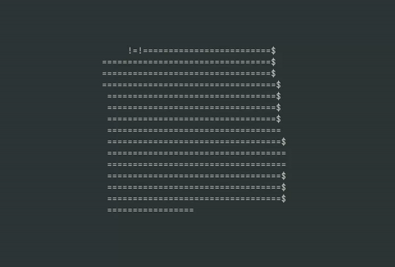

# 3D Rotation Cube
> Animación de un cubo giratorio renderizado en terminal/ventana mediante álgebra lineal.

 

Este proyecto implementa el renderizado de un objeto 3D desde cero. Se calculan las posiciones de los vértices en tiempo real usando **matrices de rotación** y se transforman a coordenadas 2D mediante una **matriz de proyección de perspectiva**.

## Tecnologías
* **Lenguaje:** C++
* **Sistema de construcción:** CMake

## Configuración y compilación
Para compilar el proyecto, asegúrate de tener CMake instalado y ejecuta:

```bash
# Generar el sistema de construcción
cmake -S . -B build

# Compilar el ejecutable
cmake --build build
